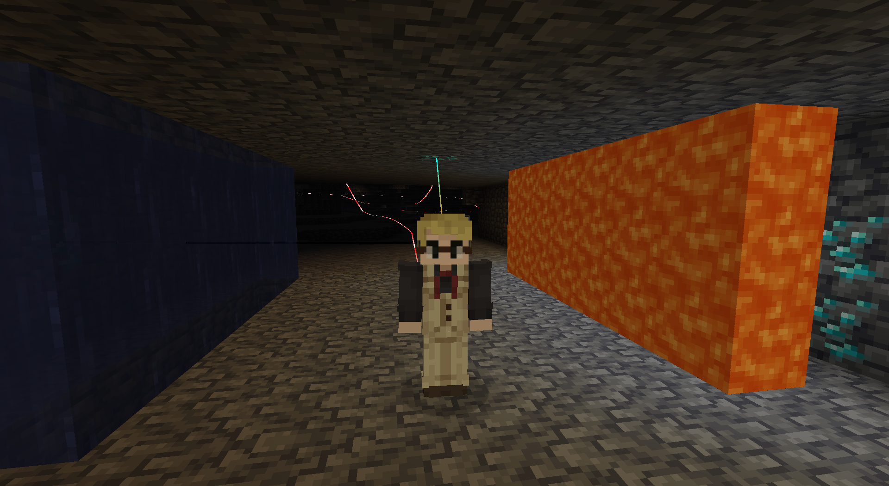

# Diamond Caving Aid – Snail Edition

A Fabric Minecraft client-side mod that drastically reduces the odds of missing exposed diamond ore that's appeared in your field of view while caving.

The Snail Edition version of the mod has sound notifications removed in compliance with the SnailCraft server rules.

---

## Features

- If you have a direct line of sight to exposed diamond ore, it draws a line from where you had a direct line of sight to it, to the diamond ore.
- Works through water, but not lava.
- Draws lines where you've been, with red being the direction you came from, and white being the direction you were headed.
- Toggleable line rendering, with the default keybind being (`\`).

---

*Diamond lines are drawn to both the ore behind water and the unobstructed ore above, but not to the ore behind lava. Path lines are visible in the back.*

---

## Installation

1. Download and add this mod to your mod folder.
2. If you haven't already; download and add the Fabric API for the same Minecraft version to your mod folder.
3. Make sure you're using the latest version of the fabric loader for that Minecraft version.

---

## Usage

Works automatically on world load. Line rendering keybind is configurable in the Key Binds menu.

---

## Technical Details

- Uses raycasting to determine if there's a direct line of sight to diamond ore.
- Searches rendered quads for diamonds to perform direct line of sight checks to.
- Uses Yarn mappings.

---

## Compatibility

- MC Version: 1.21.10.
- Loader: Fabric.
- Client-side only.

---

## License

CC0-1.0 (Creative Commons Zero v1.0 Universal)